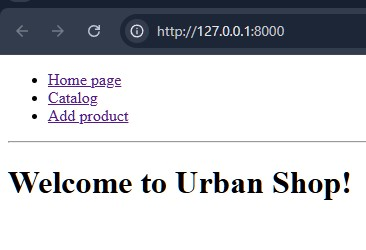
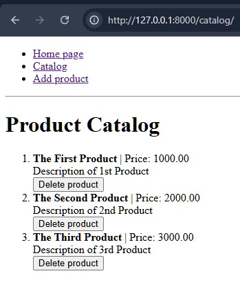
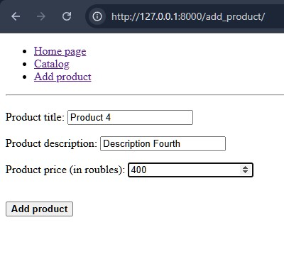

Веб-приложение предназначено для работы с каталогом товаров. 
Приложение реализовано на языке Python и фреймворке Django.
Приложение позволяет:
- просматривать текущий каталог товаров;
- удалять товары из каталога;
- добавлять товары в каталог.
 
Установка приложения (MS Windows)
---------------------------------
В среде IDE PyCharm следует клонировать проект из ссылки в GitHub:

[https://github.com/nan0gr1d/dplm/](https://github.com/nan0gr1d/dplm/)

Установить фреймворк Django и нужные библиотеки:

>> pip install django

Запуск приложения
-----------------
Для запуска приложения в среде PyCharm следует в терминале 
перейти в каталог проекта: 

>> cd [имя_проекта]

Перейти в справочник Django, где находится файл manage.py:

>> cd [django_справочник_проекта]

И запустить локальный сервер:

>> python manage.py runserver

Сервер после запуска укажет URL для вызова приложения в браузере,
обычно вот этот:  

http://127.0.0.1:8000 

Примеры работы приложения
-------------------------
_Главная страница_

_Каталог товаров_

_Форма добавления товара_

